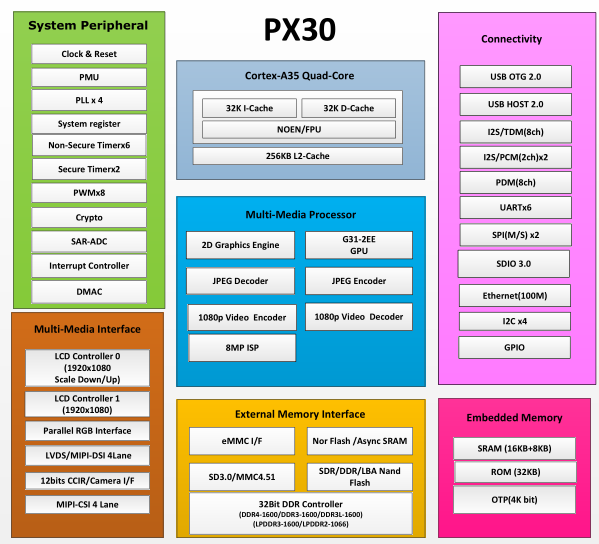

# [PX30](https://github.com/mcuyun/PX30) 

#### 归属：[cortex A35系列](https://github.com/mcuyun/CA35)
#### [关于悠云](https://github.com/mcuyun/whyme)可访问 www.mcuyun.com

## [简介](https://github.com/mcuyun/PX30/wiki)

瑞芯微4核 A35 with 1.5GHz，规格对标[RK3326](https://github.com/mcuyun/RK3326) 通信增强。

主要特点：8M ISP，6串口

功能特点：MAC 10/100 Ethernet Controller

主要短板：无HDMI等接口

封装：TFBGA418L (14mm x 14mm; ball: 0.3mm pitch 0.65mm)

### [瑞芯微平台](https://github.com/mcuyun/rockchips)

平台相关资料

#### [linux系统](https://github.com/rockchip-linux/kernel.git)

开源Linux系统固件

#### [参考资料](docs/)

包括芯片相关资料
 
---

###  [悠云，为嵌入式](http://www.mcuyun.com)   
###  qitas@qitas.cn

